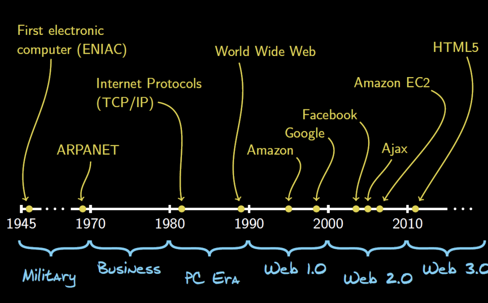
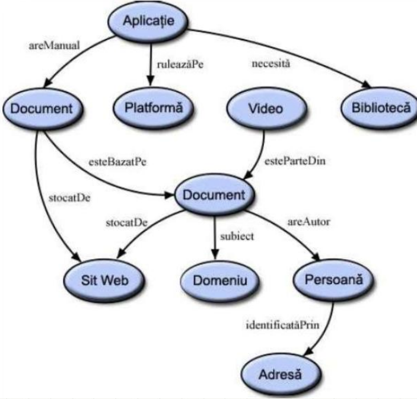
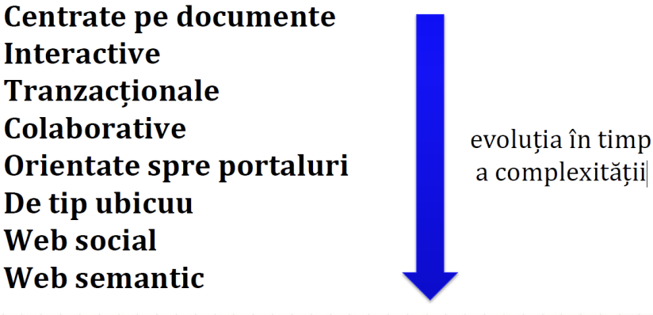
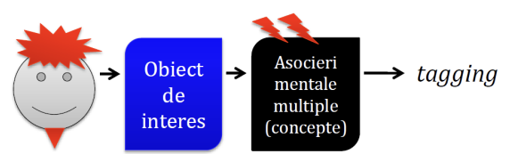
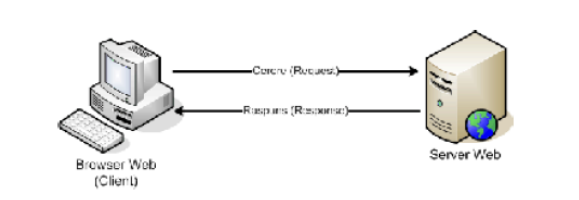
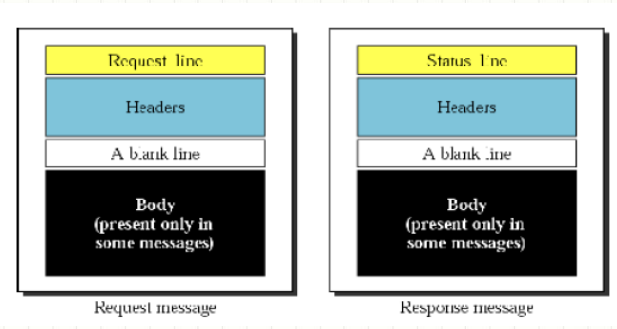
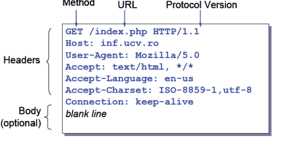
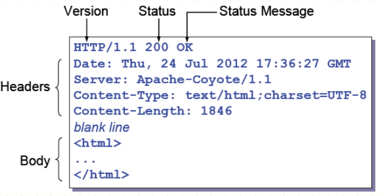
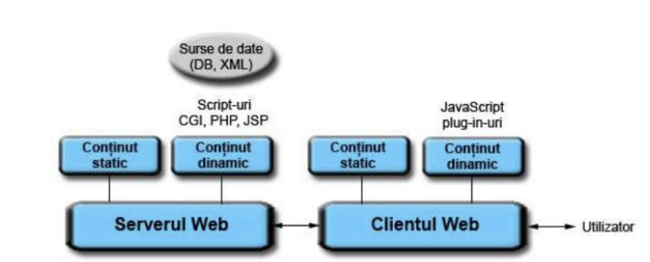

# TEHNOLOGII WEB
## INTRODUCERE
RUSU Viorel
2024

## Plan:
* Definitii si scurt istoric WWW
* Arhitecturi specifice aplicatii Web
* Protocolul HTTP
* Cereri de la clienti
* Web Hosting

## Ce este Internetul?
**Rețea de calculatoare** = ansamblu de calculatoare capabile să comunice între ele prin intermediul unor canale de comunicaţie

**Internetul** = reţea de reţele, prin care utilizatorii unui calculator sau ai unei reţele pot accesa diverse sisteme aparținând altor rețele.

## Scurt istoric WWW


## World Wide Web (WWW):
* 1989 – Tim Berners-Lee inventează World Wide Web (WWW sau WEB) la CERN.
* **WEB** = sistem de distribuție locală sau globală a informațiilor hipermedia
* Web pune la dispoziție un sistem global de standarde de comunicare multimedia, informațiile fiind organizate asociativ și fiind distribuite în funcție de cererile utilizatorilor
* Utilizează modelul client/server

## World Wide Web Consortium
* 1994 – se constituie consorţiul World Wide Web Consortium(W3C) http://www.w3.org/ condus de TimBerners-Lee
* Scop: elaborarea, dezvoltarea și menținerea de standarde pentru spațiul WWW

## World Wide Web (WWW):
Dezideratele principale ale sistemului WEB
propus de Tim Berners-Lee:
* accesul la distanţă într-o reţea, acceptându-se diverse tipuri de conexiuni;
* accesul la o multitudine de surse de informaţii stocate întro varietate de forme (text, grafica, sunet etc.) cu ajutorul unor tipuri diferite de sisteme de operare situate pe diferite platforme hardware;
* capabilităţi de extindere şi dezvoltare în ceea ce priveşte aria de acoperire prin creşterea numărului de legături, fără existenţa unui control central.

## Evoluție și definiție :
* **Web 0.0 – Developping the internet**
* **Web 1.0 – The shopping carts & static web** – Crearea site-urilor web statice, primele site-uri business modele.
* **Web 2.0 – The writing and participating web** – Interactivitate (Ajax), retele sociale, partajare media, comert online, wikis.
* **Web 3.0 – The semantic executing web** – “Web intelligent” (machine-facilitated understanding of information: semantic web, NLP, machine learning/reasoning, etc.)
* **Web 4.0 – Intelligent Web, “Mobile Web” – It is intelligent learning, self learning, self organizing**. Web 4.0 conectează în timp real toate dispozitivele din lumea reală și virtuală.
* **Web 5.0 - Open, Linked and Intelligent Web = Emotional Web** - Web 5.0 va fi despre interacțiunea (emoțională) dintre oameni și computere. Cu căștile pornite, utilizatorii vor interacționa cu conținut care interacționează cu emoțiile lor sau cu modificările recunoașterii faciale.

## Clienți și servere Web
TimBerners-Lee împreună cu echipa realizează primele patru componente cheie necesare serviciului web:
* serverul web
* browserul
* protocolul HTTP
* HTML – limbaj de descriere a hipertextului


## Aplicatii Web:
Scurt istoric HTML

| HTML Versiuni |                |
|---------------|----------------|
| HTML          | 1991           |
| HTML+         | 1993           |
| HTML2.0       | 1995           |
| HTML3.2       | 1997           |
| HTML4.01      | 1999           |
| XHTML1.0      | 2999           |
| HTML5         | Octombrie 2014 |

## Server WEB
Server WEB = program ce rulează pe un calculator conectat la Internet şi furnizează clienţilor la cerere diverse resurse Web (documente).

TimBerners-Lee în 1990 concepe primul **server Web** rulând pe calculatoare NeXT.

Apache WEB Server – cel mai popular server Web

## Browser WEB
* Browser WEB = program software (client) ce permite utilizatorilor să se conecteze la un server Web în vederea explorării resurselor găzduite de acesta (text, grafică, video, etc.);
* Protocolul utilizat: **HTTP**
* Resursele sunt identificate printr-un Uniform Resource Locator (URL)
* Cele mai populare browsere Web: Internet Explorer, Firefox, Google Chrome, Opera, Safari

## Browser Web. Caracteristici
* Posibilitatea de a realiza interogări multiple către servere
* Asigurarea securităţii transmiterilor de date
* Stabilirea de liste a site-urilor web favorite
* Memorarea istoricului navigării (history)
* Posibilitatea de a folosii mai multe ferestre de navigare
* Asigurarea suportului pentru diverse limbaje de programare folosite la realizarea paginilor Web dinamice, foi de stiluri (CSS).

## Protocolul HTTP
* **Protocol** = set de reguli de comunicare între client si server
* **Portocolul HTTP (HyperText Transfer Protocol)** = set de reguli de comunicare între un server şi browser web. (Dezvoltat în 1990 de Lee)

## Situri Web
**Site WEB = calculator pe care rulează un** server Web ce găzduiește o serie de pagini (documente) WWW înrudite ale unei organizații, companii sau persoane
* Un site web are asociată în general o adresă vizibilă în Internet (ex: http://jurnal.md)
* Un server WEB poate gestiona simultan mai multe site-uri web (virtual hosting)

## Aplicatii Web:
O **aplicaţie web reprezintă o colecţie** interconectată de pagini Web cu conţinut dinamic menită a oferi o funcţionalitate specifică utilizatorilor.

Ex: Webmail, online retail stores, online banks, online auctions, wikis, blogs, document storage, etc.

## Interacțiuni în aplicații Web


## Tipuri de aplicații Web


## Tipuri de aplicații Web
* **Centrate pe documente** – document centric; conținut/pagini static(e): situri de companii, personale
* **Interactive** : expoziții virtuale, situri de știri, sisteme de facilitare a călătoriilor (e-travel), chioșcuri informative
* **Tranzacționale** : online banking, soluții B2B (business-to-business), fluxuri de activități (workflow-uri)

## Tipuri de aplicații Web
* **Colaborative**: tele-conferințe Web, aplicații Web de tip wiki, servicii e-learning, aplicații Web peerto-peer
* **Orientate spre portaluri**: localizare unitară a informațiilor, tehnice, de afaceri, guvernamentale,… (specie: **Web-ul cetățenesc**)
* **De tip ubicuu** : servicii mobile bazate pe locația utilizatorului, disponibile pe mai multe plaforme: desktop, dispozitive mobile, tabletă,… (**Web-ul mobil**)

## Tipuri de aplicații Web
* **Web social**: mediatizare (syndication), filtrare colaborativă pe baza tagging-ului, spații de lucru virtuale, divertisment social (**social (game) computing**)

* **Web semantic (Web of Data)**: modelarea cunoștințelor, pentru a fi “înțelese” de calculatoare, date -> informații -> cunoștințe

## Localizarea resurselor WEB
Resursa Web = orice identitate digitala (document, imagine, serviciu, colectie de alte resurse)

Localizarea resurselor web în Internet se realizează prin Identificatori Uniformi de Resurse (**URI – Uniform Resource Identifier**)

## URI – Uniform Resource Identifier
Identificatorii uniformi de resurse se împart în două categorii:
* URL – Uniform Resource Locator : localizează resursa prin descrierea mecanismului de acces. Ex: http://fcim.utm.md/ro/news
* URN – Uniform Resource Name : identifică resursele prin nume, într-o formă persistentă, chiar dacă resursa a dispărut. Ex: urn:isbn:0451450523

## URL – Uniform Resource Locator
Sintaxa:
`scheme://host[:port#]/path/. . ./[;url-params][?query-string][#anchor]`

Scheme
* Constă dintr-o secvenţă de caractere care începe cu o literă urmată de orice combinaţie de litere, cifre, plus ("+"), punct
("."), sau minus ("-").
    * case-insensitive
    * oficiale:
        * file, ftp, http, https, ldap, mailto, telnet, urn, etc.
        * ex: `http://fcim.utm.md, mailto:rusu_viorel@mail.utm.md`
    * neoficiale:
        * fish, skype, callto, view-source, ymsgr, etc.
        * ex: `ymsgr:sendIM?<screenname>
view-source:http://en.wikipedia.org/wiki/URI_scheme`

## URL – Uniform Resource Locator
* **Host** : Identifică serverul web ce găzduieşte resursele
* **Port** : Identifică portul pe care rulează serverul web. Opţional
* **Path** : Identifică calea pe server unde se gaseşte resursa
* **query-string** : parametri opţionali utilizaţi în generarea pagini web.

## Protocolul HTTP

* HTTP = HyperText Transfer Protocol
* Paradigma Client/Server
* Patternul Request/Response

## Protocolul HTTP
* Standardizat de Internet Engineering Task Force (IETF) prin RFC 2616
* Este un protocol stateless (nu se menţine o stare a sesiunii de la o cerere la alta) şi asincron (un document HTML este încărcat de browser, de îndată ce părți ale acestuia sunt disponibile )
* Ultima versiune disponibilă este HTTP/1.1
* Rulează deasupra protocolului TCP. Portul standard pe care rulează fiind portul 80

## Protocolul HTTP – Sintaxa Mesajelor

## HTTP Request
* Sintaxa unei cereri HTTP
    ```
    METHOD /path-to-resource HTTP/version-number
    Header-Name-1: value
    Header-Name-2: value
    [ optional request body ]
    ```

## HTTP Request- Exemplu


## HTTP Request
METHOD poate să aibă una din următoarele valori:
* GET – Solicită un document/resursă de pe server
* HEAD – Solicită informaţii despre un document/resursă de pe server
* POST – Metodă utilizată pentru a transmite date de intrare către server
* PUT – Metodă utilizată pentru a depune un document/resursă pe server
* DELETE, OPTIONS, TRACE, CONNECT

## HTTP Response
Sintaxa unui răspuns HTTP
```
HTTP/version-number status-code message
Header-Name-1: value
Header-Name-2: value
[ response body ]
```

## HTTP Response - Exemplu


## HTTP Response
Status code
* 200 OK
* 301 Moved Permanently
* 400 Bad Request
* 401 Unauthorized
* 403 Forbidden
* 404 Not Found
* 500 Internal Server Error
* 503 Service Unavailable

## Ce este HTTPS?
S în HTTPS înseamnă „securizat”. HTTPS folosește TLS (sau SSL) pentru a cripta cererile și răspunsurile HTTP, așa că în exemplul de mai sus, în loc de text, un atacator ar vedea o grămadă de caractere aparent aleatorii.

În loc de:
```
GET /hello.txt HTTP/1.1
User-Agent: curl/7.63.0 libcurl/7.63.0 OpenSSL/1.1.l zlib/1.2.11
Host: www.example.com
Accept-Language: en
```

Atacatorul vede ceva de genul:
`t8Fw6T8UV81pQfyhDkhebbz7+oiwldr1j2gHBB3L3RFTRsQCpaSnSBZ78Vme+D pDVJPvZdZUZHpzbb`

## Cum criptează TLS/SSL cererile și răspunsurile HTTP în HTTPS?
TLS utilizează o tehnologie numită criptografie cu cheie publică: există două chei, o cheie publică și o cheie privată, iar cheia publică este partajată cu dispozitivele client prin certificatul SSL al serverului. Când un client deschide o conexiune cu un server, cele două dispozitive folosesc cheia publică și privată pentru a conveni asupra unor noi chei, numite chei de sesiune, pentru a cripta comunicațiile ulterioare între ele.

Toate cererile și răspunsurile HTTP sunt apoi criptate cu aceste chei de sesiune, astfel încât oricine interceptează comunicațiile poate vedea doar un șir de caractere aleatoriu, nu textul simplu.

## HTTP vs HTTPS


## Arhitectura aplicațiilor Web


## Arhitectura aplicațiilor Web
**Aplicație Web = Interfață + Conținut (Date) + Program**

**Interfața** : Standarde deschise: HTML, CSS, Ajax, SVG, WebGL

**Programul** : server: C#, Java, JavaScript, PHP, Ruby,…; client: JavaScript

**Datele** : relaționale (SQL), grafuri (NoSQL), JSON, XML, RDF

## Ce este un Web Hosting?
* E un serviciu ce permite postarea unui Website
* Oferă următoarele servicii:
    * Echipament special
    * Support
    * Tehnologii speciale:
        * Servere scumpe
        * Echipament de rețea
        * Acces de rețea dedicat

## Diferit tipuri de servicii de hosting Web
* Free
    * Convenabil la început
    * Calitate limitată
    * Primești cam ce plătești
* Shared – preț mic
    * Cel mai comun
    * Low-cost – puțini bani pe lună
    * Partajează resurse între website-uri
* Dedicated – Cost ridicat
    * Serviciu dedicat, personalizat
    * Rezervat pentru afaceri largi
* Cloud Computing hosting
    * Utility Computing (Hosting customizat – plătești ce consumi)

## Tipuri de servicii prestate de Hosting-uri
* Spațiu de disc pentru fișiere
    * HTML
    * Imagini
    * Etc.
* Conturi de Email
* File transfer software (FTP)
* Management software
* Internet fiabil
* Economie

## Alegerea Web Hosing-ului
* Free hosting:
    * De regulă lent
    * Posibil costuri ascunse
    * Publicitate
    * Instrumente limitate
* Low cost Hosting:
    * Oferă instrumente utile
    * Preț mic
    * Accesibil
    * Exemplu : www.godaddy.com

## Cum de ales nume pentru site?
* Caracteristici pentru un nume bun:
    * Ușor de tapat
    * Scurt
    * Cuvinte cu sens legat
    * Evitați semnele speciale sau numere
    * Verificați ideea cu prietenii
    * Nu riscați probleme legale:
        * Cocakola.com
        * Amazonn.com

## Alege extensia pentru site-ul tau
* Luați în calcul diferite extensii:
    * .com
    * .net
    * .org
    * .co
    * .info
    * .biz
    * .md
* Când credeți că aveți un nume bun - acționați
rapid

## Elemente de bază de rețea:
* Yahoo.com
```
46.228.47.254 = IP adresă
(IP=Internet Protocol)
```
* Domain Name Service = DNS
    * Găsește o adresă IP după nume
    * Rulează pe
        * Serverele de servicii de Hosting
        * ISP = Internet Service Provider
        * Smartphone or celular provider

## La ce servește DNS-ul?
* Permite să utilizați nume
* Nu e nevoie de utilizat numere complicate
* Vă protejează de modificări a adresei IP
* Verificați IP-ul și locația utilizând
    * Whois.domaintools.com
