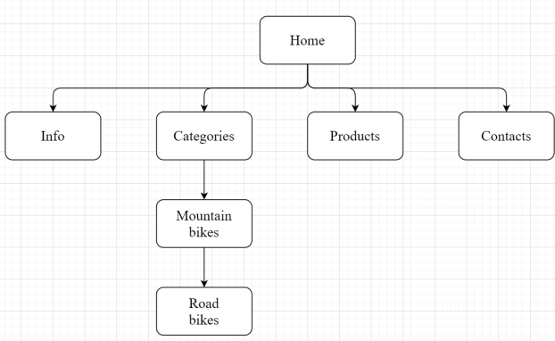
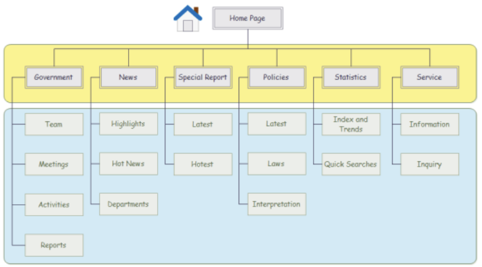

# Laborator 1

**Tema**: Conceperea unei aplicații Web. Crearea conținutului Web utilizând HTML, CSS

**Scop**: Crearea conținutului Web utilizând HTML, CSS

1. Instalare server Web
    1. Se studiaza diferite aplicatii/pachete ce permit instalarea serverului web pe local (exemple: XAMPP, WAMP, EasyPHP, AMPPS, AppServ, etc.);
    2. Se motiveaza alegerea unuia din acestea si se instaleaza pe calculator;
    3. Studiati posibilitatile de a crea hosturi virtuale, creati citeva;
    4. Creati câteva pagini web pentru testarea serverului web.
2. HTML5/CSS
    1. alegeti un subiect pentru a dezvolta un site;
    2. descrieti succint acesta;
    3. creati modelul functional al site-ului;
    4. creati paginile informative statice utilizind HTML/CSS (acestea trebuie sa contina meniuri derulante, blocuri dinamice, formulare, s.a.). Trebuie separat explicit contentul HTML de CSS.

Incarcati raportul in format electronic pe pagna cursului de pe else.fcim.utm.md la sarcina respectiva.

Se va prezenta pagina Web la calculator si se va apara laboratorul efectuat.

Exemplu 1 : Site pentru comert ce are pagini ca informatii generale, categotii, produse, contacte. Reprezentare Functional-Ierarhica

Exemplu 2 : Site cu mai multe pagini informative (reprezentare ierarhica).

